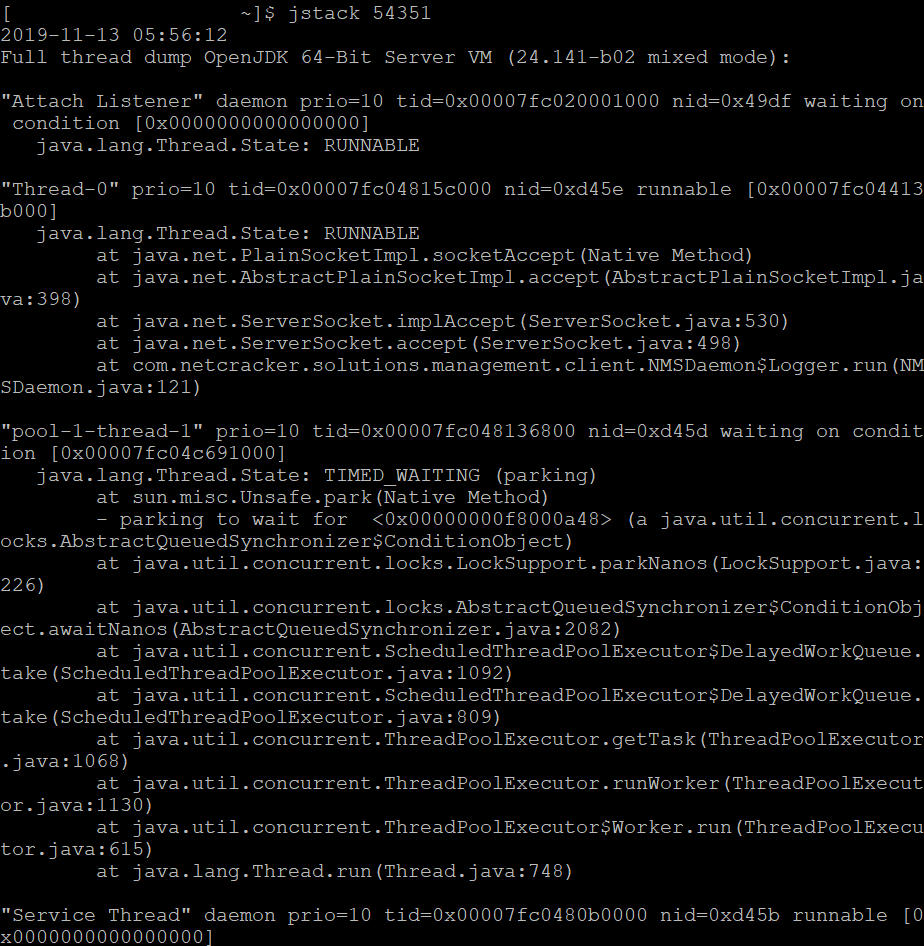

Show all process status
```
ps -ef | grep java
-e flag/option to print all the processes within the system, not just the ones from the current terminal
-f flag to see more details output
```


Kill command
```
kill 123 = kill -s SIGTERM 123 = kill -15 123
```
- The default behavior of kill is to send the SIGTERM signal to a process, by which we ask that process to gracefully shutdown
```
kill -s SIGQUIT 123 = kill -3 123
```
- Sending a process the SIGQUIT signal is the same as asking it to shutdown with SIGTERM. The difference is that SIGQUIT makes the OS perform what is called a core dump:
  - The core dump is a snapshot of the working memory of the process at the time we sent the kill signal and by default will be written to the current working directory.
  - We can use core dumps for debugging purposes.
- Note that while quitting is the default behavior, Java is an example of a process that doesn’t quit with a SIGQUIT, it only does a core dump.
  
```
kill -s SIGKILL 123 = kill -9 123
```
- By choice of the programmer, processes don’t have to respond to every signal.
- In such a case, or for processes that are hogging CPU for example, we can force it to terminate using the SIGKILL signal:
- With SIGKILL we ask the kernel to immediately shut down the process. The process dies and won’t clean up after itself.
- This means there is a risk of data loss or even worse, data corruption.


References
- [Kill Commands in Linux](https://www.baeldung.com/linux/kill-commands)
