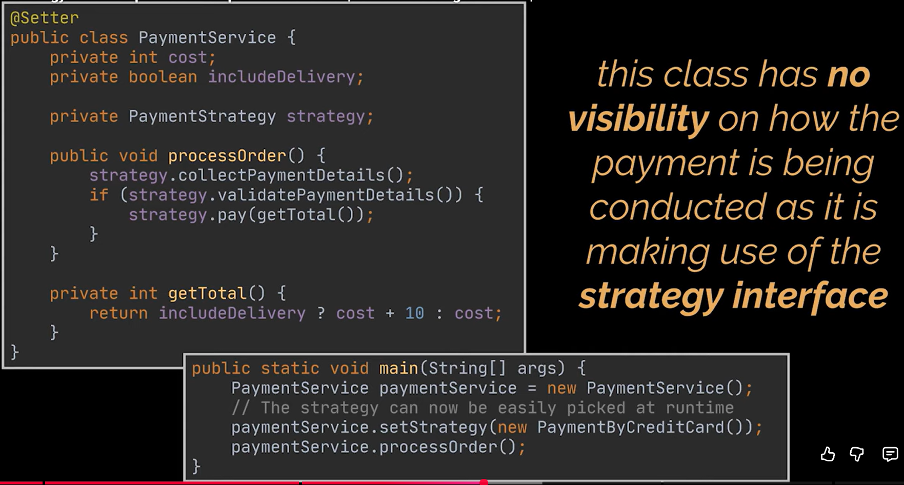

Strategy pattern
- Problems may arise if you try to  add to this currently working piece of code several payment methods like PayPal for example. In this case you will need to wrap your current code with an if-statement or switch case and then introduce the new payment method alongside all its required working logic. Now, while this may seem an appropriate solution for the short term, it will be hard to maintain on the long run especially if you decide to introduce even more payment methods. You see, what we just created is a block of code that is closed for extension and open for modification because every time a change is required we are  going to have to open this method and modify it and that is obviously not what is stated  by the open-closed principle we all know.
- Additionally, this class  handles several functionalities, so far in this example it handles both payments by credit card and through PayPal and that contradicts the single  responsibility principle as well

- To fix this what we need is kind of a strategy  that places each payment method in its own class making this class responsible  for a particular payment method and additionally these classes we  create should be easily interchangeable or replaceable by one another. One way to do this is to apply the Strategy Design Pattern
- The strategy pattern is a behavioral design pattern that lets you define a family of algorithms, put each of them into a separate class,  and make their objects interchangeable.

- To do this and as we just mentioned  we have to start by extracting each payment specific logic to its own class in our example we are going to have the PaymentByCreditCard and  the PaymentByPayPal classes and to make these classes interchangeable  what you have to do is create a common interface for all of them to implement. You can also go one step further and extract the common behaviors into separate methods instead  of dumping all the logic into a single one. So in this example we can extract  the collectPaymentDetails, the validatePaymentDetails and the pay methods this will grant us more flexibility later on while shaping the skeleton of the common  algorithm all these strategies should make use of.
