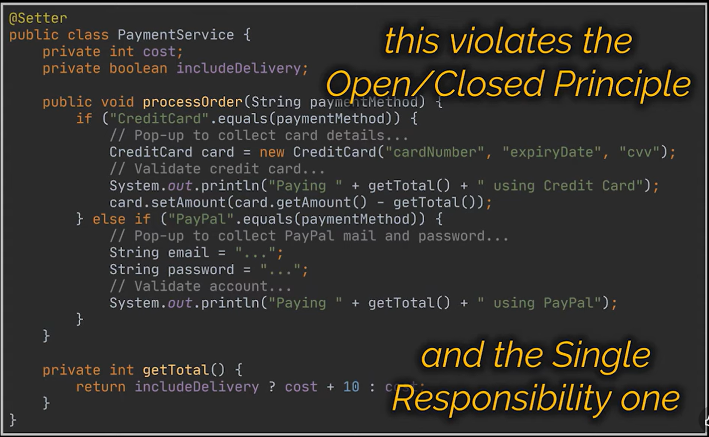

Strategy pattern
- Problems may arise if you try to  add to this currently working piece of code several payment methods like PayPal for example. In this case you will need to wrap your current code with an if-statement or switch case and then introduce the new payment method alongside all its required working logic. Now, while this may seem an appropriate solution for the short term, it will be hard to maintain on the long run especially if you decide to introduce even more payment methods. You see, what we just created is a block of code that is closed for extension and open for modification because every time a change is required we are  going to have to open this method and modify it and that is obviously not what is stated  by the open-closed principle we all know.
- Additionally, this class  handles several functionalities, so far in this example it handles both payments by credit card and through PayPal and that contradicts the single  responsibility principle as well

