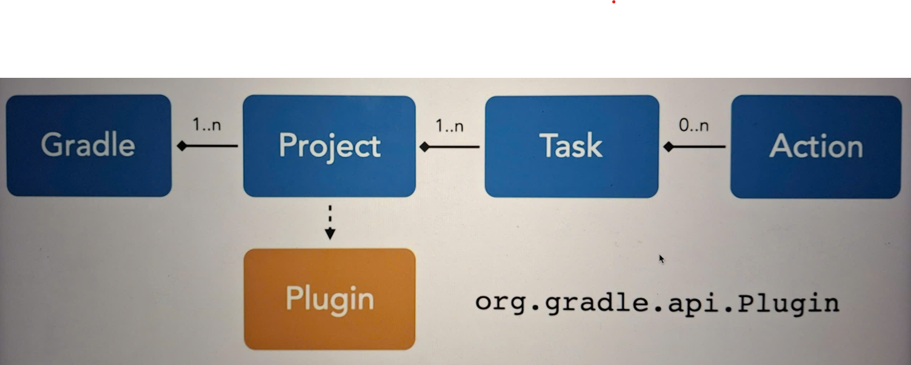

### Gradle
- is an extensive build tool and dependency manager for programming projects
	- build deployment artifacts (Java war/jar/apk files)
	- manages dependencies
- it can automate the building, testing, publishing, deployment and more of software packages or other types of projects such as generated static websites, generated documentation, deployment artifacts or anything else
- Maven was released in 2004 based on XML and XML can be a bit hard to read and a little bit verbose. As projects got more and more complex, the builds got corespondingly more complex.
- In about 2007, Gradle was released to allow builds to be described in a different language rather than XML. They would be described in a programming language like groovy - a variant of Java. Now, it became easier to make modifications to the build and make them more complicated because we're using a programming language rather than the declarative XML technique.

### What are dependencies
- Open-source Java libraries
- Libraries from other parts of your enterprise
- Proprietary vendor libraries

### What are artifacts
- is just a general term to describe a file
	- Files
	- Java source and class files
	- XML and configuration files
	- Any graphic, audio or video files
	- Additional file resources

### Task in Gradle
- Tasks in gradle are the detailed build steps or an executable unit of work.
- The representation of tasks as objects in memory is so-called domain objects. Domain objects can be inspected and modified from the build script
- There are 2 types of task:
	- ad hoc task: is a good fit for one-off, simplistic action implementations by defining actions, such as doFirst or doLast. It doesn't need to define an explicit type as it automatically extends DefaultTask interface
	```
	task helloWorld { // No explicit type
		doLast { // action definition containing logic to be executed at runtime
			println "Hello World!, version = " + version 
		}
	}
	```
	- typed task: explicitly declares a type with a dedicated purpose, for example, the copy type can copy files and directories. We don't necessarily need to define actions as they are already provided by type
	```
	task copyFiles(type: Copy) { //Explicit type
		from "sourceFiles"	//Method provided by Copy API
		into "target"
	}
	```

### 6 key features of Gradle
- Build file or build script
	- the default name of the build file is build.gradle
	- it contains the build logic of the project and resides in the root of a project
	- is human and machine readable instruction file
	- partly it's declarative, partly it's programmatic or imperative logic
	- it uses a DSL - domain specific language that will give us kind of a high-level abstraction language for describing the build at even greater level of details.There are 2 options:
		- Groovy DSL: use the semantics of the Groovy programming language and can implement any imperative logic using Groovy syntax
		- Kotlin DSL
- Construct a graph of tasks
	- Gradle parses the build.gradle file by reading it and gets the tasks from that
	- Gradle builds a complete DAG (directed acyclic graph) in memory and then knows what to do
- Execute the tasks
	- Gradle executes the tasks in the graph in the order that it has figured out they have to be executed
	- Each task gets some input and produces some output that's used by the next task
	- Gradle saves the output of each task
		- This is very important for improving the Gradle performance. When we rerun the build, which we'll do quite often, if the output of a task is the same, we don't need to rerun the next task. In that case, we can skip the task, move on to the next one for when something's actually changed
- Manage dependencies
	- Dependencies themselves may have additional internal dependencies - transitive dependencies. Gradle also manage those for us.
	- we need to get the correct version of the dependency
- Gradle uses repositories
	- It is just a storehouse of these external dependencies
	- These repositories may live on the Internet or within the enterprise or even on the local machine
- Self-updating
	- Auto-retrieval of new versions of Gradle itself
	- Dependencies might change over time, Gradle can monitor and auto-retrieval of new versions of dependencies

### Lifecycle Phases
- Gradle executes every build in three lifecycle phases:
	- Initialization: evaluates the settings.gradle file and setup the build
	- Configuration: parses and evaluates the build logic specified in one or many build scripts. During this phase, task actions are only configured, not executed, for example, assigning values to properties or calling task methods
		- Configuration code configures the project and its task and is executed in configuration phase
		- The logic needs to be defined outside of the task actions - doFirst and doLast
		```
		// configuration code
		task helloWorld {
			// configuration code 
			doFirst {}
			doLast {}
		}
		```
	- Execution: looks at the DAG built in memory and executes every task action in the correct order
		- any logic that should be executed during the execution phase needs to be defined as part of the doFirst and doLast actions
		```
		task helloWorld {
			doFirst {
				// execution code
			}
			doLast {
				// execution code 
			}
		}
		```

### How to create Gradle task and execute it
- In build.gradle file or build script using Groovy DSL
```
task helloWorld {
	doLast {
		println "Hello World!, version = " + version // The print line statement is a method call provided by Groovy language to print the message to standard output
	}
}
```
- In build.gradle.kts file using Kotlin DSL
```
tasks.create("helloWorld") {
	doLast {
		println("Hello World!")
	}
}
```
- In gradle.properties file
```
version = 1.0.0
```
- execute the task from command line
```
gradle helloWorld

Output:
> Task: helloWorld
Hello World!, version = 1.0.0
```

### Create Gradle task which copy markdown file to build/docs folder and zip them
- Define tasks in build.gradle
```
task copyDocs(type: Copy) {
	from "src"
	into "build/docs"
	include "**/*.md"
	includeEmptyDirs = false
}

task createZip(type: Zip) {
	from "build/docs"
	archiveFileName = "docs.zip"
	destinationDirectory = file("build/dist")
	dependsOn copyDocs
}
```
- Run command `gradle createZip`

### How to visualize the DAG of a specific task
- The first way: run command `gradle createZip --dry-run`
	- The option --dry-run shows all tasks on the terminal but doesn't execute their actions
- The second way: import the community plugin called gradle-task-tree to view all of the Gradle tasks
```
// build.gradle
plugins {
	id "com.dorongold.task-tree" version "4.0.1"
}

// run command
./gradlew taskTree
```

### Gradle wrapper
- When we works on many projects, we usually maintain a set of Gradle installations on the machine and switch between them depending on the project that you're wokring on. Gradle use the functionality called Gradle wrapper to standardize the compatible Gradle version for a project and relieve you from the burden of having to maintain multiple gradle installations
- Gradle Wrapper is a set of files checked into SCM alongside source code. They are generated by running command `gradle wrapper`
- By checking in a couple of files like wrapper/gradle-wrapper.properties, Gradle will automatically download the Gradle distribution with defined version at runtime, install it on your machine and execute the build with it right away

### Settings file in a build
- the default name is settings.gradle
- it resides in root directory of project hierarchy
- it declares participating projects in a multi-project build or just a single build
- it can change defaults, for example: project name

### Gradle Properties File
- the default name is gradle.properties
- It resides in root directory of project hierarchy or Gradle user home directory
- it pre-defines runtime options for your build, as a means to externalize custom key-value pair, which is used in the build.gradle file

### Gradle command line
```
gradle -version
```
- show info of project
```
gradle projects

Output:
Root project 'eventing-tools'
No sub-projects
```
- How to change project name, the default is that Gradle automatically derives it from the root directory
```
// settings.gradle
rootProject.name = 'eventing-tools'
```
- How to change log level of Gradle
```
Option 1: apply for a specific Gradle build 
// gradle.properties
org.gradle.logging.level = info
version = 1.0.0 // define custom key-value pair

Option 2: apply globally
// ~/.gradle/gradle.properties
org.gradle.logging.level = info
```
- List all the tasks of the project
```
gradle tasks --all // not include dependencies
```
### Gradle plugin
- Gradle introduces the concept of plugin in order to:
	- Avoid repetitive code
	- Make build logic more maintainable
	- Provide reusable functionality across projects
- There are two types of plugins:
	- Script plugin: is just another build script that can be included into your main build.gradle file. The primary reason to use the script plugin is to split up the build logic and make it more maintainable.
		For example: build.gradle includes publishing.gradle and deployment.gradle - same syntax, just a different file
		```
		\\ build.gradle
		apply from: "publishing.gradle"
		apply from: "deployment.gradle"
		```
	- Binary plugin: is meant for more complex logic bundled into a jar file. The reason being that you can reuse the functionality across multiple diffrent repositories.
		- They are also available as part of the gradle distribution, so-called core plugins. But there are some community plugins out there which are available on the Gradle plugin portal
		- For example: build.gradle includes Gradle core plugin and Community plugin - implemented as classes, bundled as jar files
		```
		\\ build.gradle
		apply plugin: "base"
		```

### Domain objects

- org.gradle.invocation.Gradle represents each invocation of a gradle build. This domain object has knowledge about the project hierarchy in a single project or multi project build and provides pointer to the higher-level properties of a build.
	- For example: register callback logic to react to certain events in the build
- org.gradle.api.Project serves as the main entry point of a build. It represents a software component and provides methods/API access to the whole hierarchy of domain objects
	- For example: you could ask for the reference to the gradle instance, register new tasks or get and modify typical environmental properties like the build output directory
- org.gradle.api.Task represents unit of work with potential dependencies and is performed at runtime. Every task can declare task dependencies.
- org.gradle.api.Action represents actual work performed during execution phase. Gradle executes those actions in order of declaration but doFirst happens before doLast
- org.gradle.api.Plugin represents each plugin you apply to a project and provides reusable logic for a project. A plugin has full access to the project it works on and therefore can access other domain objects by name or by type and modify them as necessary.


### Gradle Java Plugin
- is a core Gradle plugin bundled with the gradle distribution
- it provides tasks to help projects with compiling, testing and bundling Java source code without having to write custom build logic
- The plugin introduces conventions and sensible defaults that work for most projects. For example: build/classes contains compiled class files, build/libs contains generated JAR file - Jave ARchive file. Conventions can be configured in the build script to adapt to legacy project structures

### Java application plugin
- helps with creating executable JVM applications. It serves different use cases:
	- do "run" task for local development by executing the run task that runs your program without having to build a distribution
	- execute installDist task to generate OS-specific scripts suitable for starting the program
	- bundle the generated application files into an archive as the distribution as ZIP or TAR file using the tasks distZip or distTar task

### Basic build.gradle in Java project

```
plugins {
	id 'java'	// Add gradle java plugin
	id 'application'
}

version = '1.0.0'

java {
	// Assume a source and target compatibility of version 11 with the help of Java extension created by the Java plugin
	sourceCompatibility = JavaVersion.VERSION_11
	targetCompatibility = JavaVersion.VERSION_11
}

application {	// required extension when using application plugin
	mainClass = 'com.linkedinlearning.calculator.Main'
}

repositories {
	mavenCentral()
}

dependencies {
	implementation project(':api') // add the other sibling module in the repo 
	implementation 'commons-cli:commons-cli:1.4' // implementation is the scope of dependency
}

compileJava {
	options.compilerArgs << '-Werror'	// terminate compilation if a warning occurs
}

jar {
	archiveBaseName = 'calculator' // set the name of jar file
}

---------

./gradlew classes --console=verbose
> Task :compileJava UP-TO-DATE
> Task :processResources NO_SOURCE	// copy the files from source/main/resources into the build directory, NO_SOURCE means there is no files to do
> Task :classes UP-TO-DATE	// aggregate both tasks above

./gradlew jar	// create jar file with the name of project name or project directory

./gradlew run --args="add 1 2"

./gradlew installDist
cd build/install/calculator/bin
./calculater add 1 2

./gradlew distZip distTar // generate archive in build/distributions

./gradlew dependencies // render the full tree of dependencies for all configurations available in the project

./gradlew dependencyInsight --dependency gson --configuration compileCLasspath

./gradlew projects // render the projects taking part in the build
```

### Dependency resolution
- Gradle Dependency Management Engine downloads its artifacts, stores them in the local cache for reuse and adds them to the classpath of the project
- Gradle calls the scope of a dependency as a configuration:
	- implementation: adds the dependency for compiling the code and running the application
	- compileOnly
	- default
	- runtimeClasspath: represents the runtime classpath of the application and therefore automatically inherits the dependencies required for compilation
	- compileClasspath