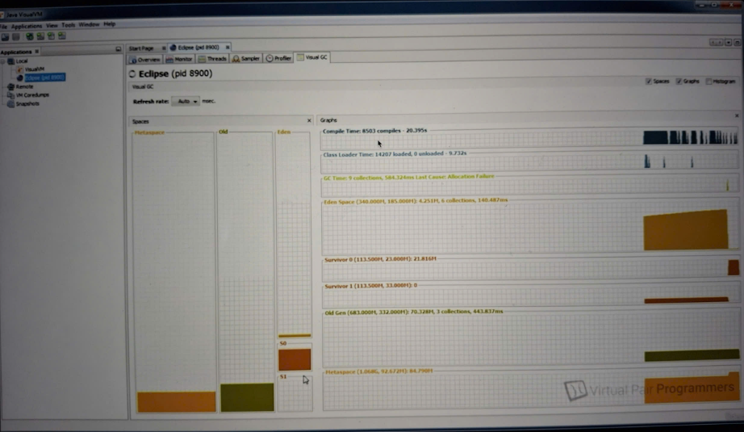
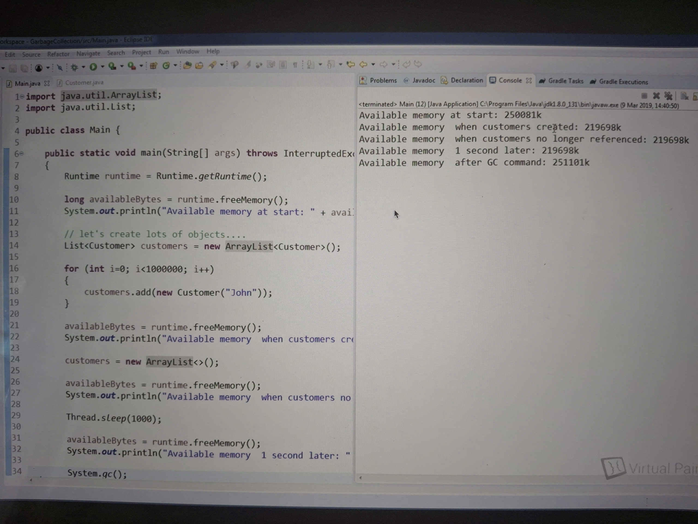
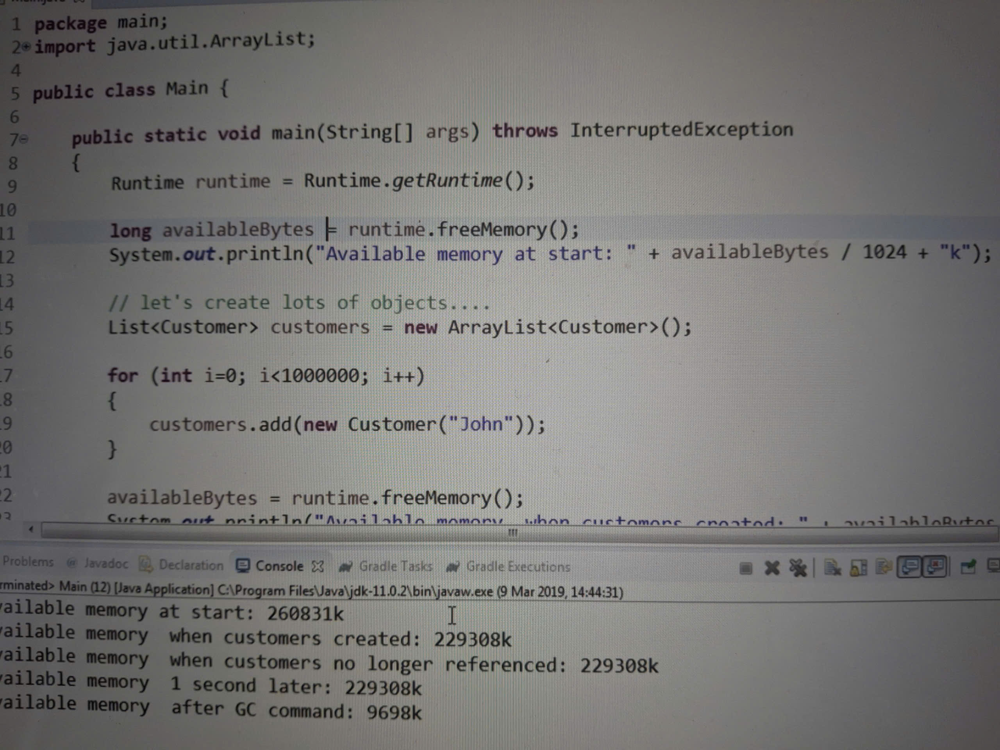
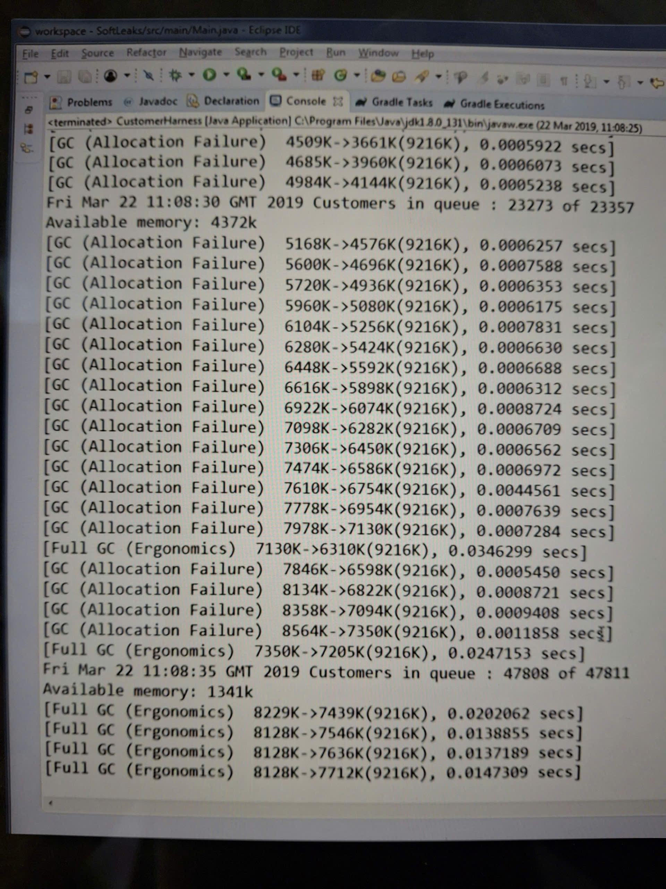

### How to generate thread dump in Java application
- `kill -3 <pid>` -> generate a core dump in the logging of application
- `jstack <pid> | more`
- using VisualVM tool to capture thread dump:
  - right click in left sidevar
  - press ThreadDump button in Threads tab
- using two flags to generate a heap dump automatically when happening OutOfMemory
  - -XX:+HeapDumpOnOutOfMemoryError
  - -XX:HeapDumpPath=someFilePath


### Garbage collection
- It was actually invented in 1959 with the Lisp programming language. However, Java made the concept of garbage collection more popular.
- The idea of garbage collection is that programmers ask for objects to be allocated on the heap, but they don't need to free them when they're finished with them.
- Instead, an automatic process will analyze the heap and it aims to work out which objects are no longer needed and any unneeded objects can be deleted, and the memory that they occupy can be freed up.
- JDK provides four options for garbage collectors:
  - Serial GC
  - Parallel GC
  - G1 GC
  - ZGC
- Any object on the heap which cannot be reached through a reference from the stack is eligible for garabge collection (use the term of unreachable instead of unreferenced)
- For completeness, static objects are referenced from the meta space. The references from the meta space will never be deleted. These objects will never be eligible for garbage collection
- gc() method is actually a suggestion to tell JVM to run a garbage collection process, but there's no guarantee that the JVM will actually do that

### How GC works
- Rather than searching for all the objects to remove, instead the garbage collector looks for all of the objects that need to be retained and it rescues them.
- The general algorithm that garbage collectors use is called Mark and Sweep, and this is a two stage process:
  - Marking stage:
    - The program's execution is first paused, and this is sometimes called a stop the world event. Marking cannot work properly if there are any threads still executing, so all the threads in the application are paused
    - The garbage collector then checks every single live reference. It simply looks at every variable on the stack and in the meta space if there are static variables. Then it follows its reference, the objects that it finds at the end of the reference are marked as being alive, and it follows any other references that the object has and marks the sub objects as being alive.
  - Sweeping stage
    - Once all the referenced objects are marked for keeping, a full scan of the heap can take place and the memory occupied by the objects that have not been marked during the marking phase can then be freed up.
    - Finally, the objects that are being kept are moved into a single contiguous block of memory. This stops the heap from becoming fragmented over time and makes it easier and quicker for JVM to find memory to allocate to future objects.
- In fact, the garbage collector doesn't really collect any garbage. It actually collects the alive objects and saves them. This means that the more garbage there is, the garbage collection process is actually faster. If everything on the heap was garbage, the garbage collection process would be pretty much instantaneous
- In fact, most of the time, the garbage collection never looks at the entire heap, but rather just at one small part of it.

### Why the heap is divided into generations
- In case there are lots of objects which are not garbage, the stop of world event takes more time and happens seriously. Then the users of our application will probably notice that our applications has frozen perhaps for a few seconds at a time.
- The starting point for understanding generational GC is that
  - Most objects in Java live for a very short period of time. If an object survives one garbage collection, then it's more likely to live forever.
  - It's faster to run the garbage colection process when there's a lot of garbage or when there's only a few objects that are going to survive
- To make the process as efficient as possible, the heap is actualy organized into separate sections, known as generational garbage collection

### The internals of GC
- The heap is divided into two sections:
  - Young generation
    - New objects are created in the young generation space. The young generation space will fill up quite quickly as it's small. When it's full, a garbage collection takes place, but only on the young generation, known as a minor collection
    - Because most objects don't survive for long, the young generation, which is full of new objects, is probably mostly garbage. The process to garbage collect in the young generation should be very quick, approximately fractions of a second
    - As your application runs, there will be lots of minor garbage collections taking place including compacting process, they'll be pretty much instantaneous because the young generation will be quite small and mostly full of garbage.
    - is split into a further three separate sections: Eden, S0 and S1 - survivor spaces
  - Old generation
    - Any surviving objects are then moved to the old generation
    - Garbage collection will also run on the old generation, but only if it's needed, for example, if it gets full, known as a major collection
    - A major collection will be a lot slower, approximately a few seconds, because it's a much bigger block of memory to sweep and there may be many objects in the old generation that are still alive. Of course, the compacting process moving all the surviving objects into a single contiguous part of the memory. That will take some time.



### The internals of Young Generation
- The young generation is split into 3 sections: Eden, S0 and S1 - survivor spaces
  - When an object is created, it's placed in the Eden space. When the Eden space gets full, which will happen quite quickly because it's pretty small, the garbage collection process will take place on the Eden space. Any surviving objects are moved into S0
  - More objects are created and Eden gets full again, the garbage collection process take places again. But this time, it looks at everything in the Eden space and S0. Any objects that survive get moved into S1. So now S0 and Eden are both empty again.
  - More objects are created and Eden gets full again, the garbage collection process take places again. But this time, it looks at Eden and S1. It moves any surviving objects into S0.
  - After a number of these swaps or minor garbage collections or generations, the object is determined to be a long surviving object and will be moved from S0 or S1 into the old generation
- S0 and S1 are two parts of the young generation that are used to swap the surviving objects. There's no meaning to the zero and the one. There's no priority here. They take alternating turns in holding the surviving objects
- In the marking process, we're actually not looking at the entire young generation. We're looking at about two thirds of it: Eden space and either S0 or S1.
- There is one minor negative impact from this process, which is that at all times either zero or S1 will always be empty. So there's a small amount of memory that will always be unused, but that's a minor tradeoff for the performance improvements that this process gives us

### ZGC
- is a scalable low-latency concurrent garbage collector capable of handling heaps ranging from 8MB to 16TB in size, with sub-milisecond max pause times


### Memory leak
- is defined that when one object is not in use, the memory occupied by objects haven't been freed up and is still there.
- If you're running programs that have a memory leak, then over time, more and more of your computer's memory will get used up and eventually your computer will start to slow down and even crash
- Memory leaks shouldn't be possible in Java

### Soft leak
- is when an object remains referenced from somewhere on the stack when no longer needed
- Your application is holding memory within the heap that can be never used again. It is running the risk of possibly running out of available heap space on a long running application such as a web server.


### How does Java application request heap memory for new object
- When you call the new keyword in Java to create a new object, you aren't actually taking memary from the operating system. The memory is acquired by the virtual machine.
- The virtual machine is actually just another program written in C, and this C program will control the request for memory objects from the operating system, and it controls the freeing up of memory when objects are no longer needed. So we can think of the virtual machine as deciding when to put in the call to the free function that C needs to release memory.

### Java is a managed language
- Memory leaks should be avoided in JVM because designers of the virtual machine have correctly ensured there are no leaks in the implementation
- Java avoids memory leaks is with the strategy of garbage collection

### What is the difference between the garbage collection algorithms in Java 8 & 11
- In Java 11, if the JVM has got lots of allocated memory that your application really don't need, the JVM will give some of it back to the OS when garbage collection runs
- The amount of memory that the JVM has taken from the OS to run your application:
  - if you're running Java 8 or below, it can never go down
  - But in Java 11, it can go down
- However, following the enhancement, everytime the JVM goes to the OS to request for memory, there will be a slight impact on performance.
- The way that we can get around is by using a flag -Xms300m to tell the JVM which initial heap size for your application. JVM  will never let the amount of memory you've reserved go below that initial heap size



### finalize() method
- When an object is actually garbage collected, it means when the garbage collection process physically removes the object from the heap rather than when it becomes eligible for garbage collection, at this point, Java will run the finalize() method of that object
- finalize() method was deprecated from Java 9
- You must never put some kind of code, such as closing resouces in the finalize() method because you don't know if it's ever going to run
- If your program reaches the end, even if the heap is clustered with lots of objects which are eligible for garbage collection, the JVM might decide not to bother running the garabage collector. In fact, the JVM will simply release all of its allocated memory back to the OS. Thus, these finalize() methods will never be called.

### GC runtime arguments
- monitor how often garbage collection is taking place in the application



```
-verbose:gc
+ GC: minor garbage collection
+ Full GC: major garbage collection
+ Allocation Failure: there wasn't enough space in that part of the heap to create a new object. So it had to do a GC to free up some space
+ Ergonomics: JVM is trying to change the structure of the heap to make this perform well
+ <the size of the heap before GC runs>-><the size of the heap after GC runs>(<total size of the heap>)
```