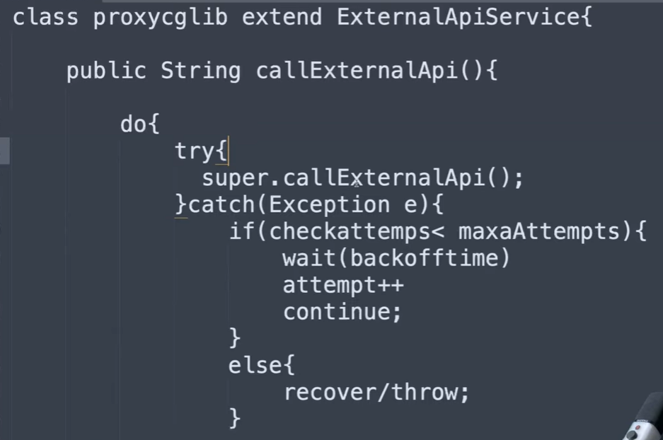

The scope of bean
- Longer-lived bean:
  - Singleton: returns the same instance when it is invokeed each time
- Shorter-lived bean:
  - Prototype: returns new instance when it is invokeed each time, @Scope("prototype")
  - Request
  - Session


Spring Retry
- exposes a library which contains automatic retry mechanism inside Spring framework
- it works on proxy-based approach or Spring AOP -> it will scan @Retryable, @Recovery annotations and create the proxy, which is a wrapper of the class containing these annotations
```
@Retryable(
  retryFor = RuntimeException.class,
  maxAttempts = 4,
  backoff = @Backoff(delay = 2000, multipler = 2.0)
)
public String callExternalApi() {}

@Recover
public String recover(RuntimeException e) {}
```




Proxy in Spring
- There are a couple of types of proxies: CGLIB or JDK dynamic

ObjectProvider
- is a special Spring injection mechanism that lets you fetch a bean lazily and dynamically at runtime
- There is a BeanFactory inside ObjectProvider, it will check whether the target bean is prototype and if yes, return new bean


Scoped Proxy
- is a Spring-generated proxy object of shorter-lived (prototype, request, session) bean
- Instead of injecting shorter-lived bean into a longer-lived bean (like a singleton), Spring will inject scoped proxy into the singleton in order to fetch shorter-lived bean lazily at runtime


How to make a prototype bean injected lazily into singleton bean?
- ObjectProvider
```
@Service
public class SingletonServiceWithObjectFactory {
  @Autowired
  private ObjectProvider<PrototypeBean> provider;

  public void serve() {
    provider.getObject().print(); //each time serve() method is invoked, a new instance of PrototypeBean class is returned
  }
}
```
- Scoped Proxy


