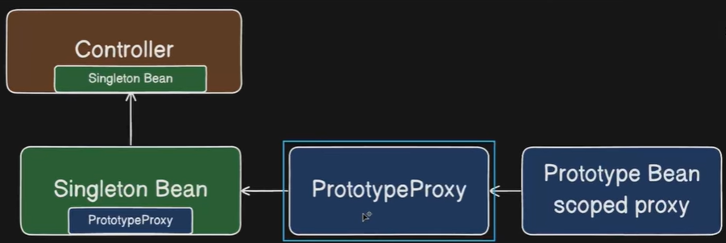
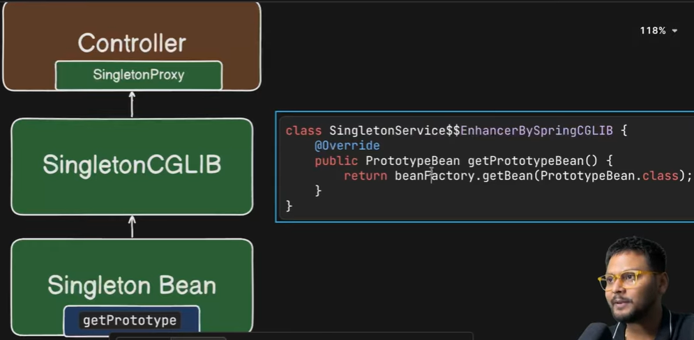

The scope of bean
- Longer-lived bean:
  - Singleton: returns the same instance when it is invokeed each time
- Shorter-lived bean:
  - Prototype: returns new instance when it is invokeed each time, @Scope("prototype")
  - Request
  - Session


Spring Retry
- exposes a library which contains automatic retry mechanism inside Spring framework
- it works on proxy-based approach or Spring AOP -> it will scan @Retryable, @Recovery annotations and create the proxy, which is a wrapper of the class containing these annotations
```
@Retryable(
  retryFor = RuntimeException.class,
  maxAttempts = 4,
  backoff = @Backoff(delay = 2000, multipler = 2.0)
)
public String callExternalApi() {}

@Recover
public String recover(RuntimeException e) {}
```


Proxy in Spring
- There are a couple of types of proxies: CGLIB or JDK dynamic

ObjectProvider
- is a special Spring injection mechanism that lets you fetch a bean lazily and dynamically at runtime
- There is a BeanFactory inside ObjectProvider, it will check whether the target bean is prototype and if yes, return new bean


Scoped Proxy
- is a technique to inject short-lived bean into a long-lived bean in order to fetch short-lived bean lazily at runtime
- it will create Spring-generated proxy object of short-lived bean. Then, Spring will inject proxy object into the long-lived bean instead of short-lived bean 
- There is a BeanFactory inside proxy object cglib, it will check whether the target bean is prototype and if yes, return new bean
  

How to make a prototype bean injected lazily into singleton bean?
- ObjectProvider
```
@Service
public class SingletonServiceWithObjectFactory {
  @Autowired
  private ObjectProvider<PrototypeBean> provider;

  public void serve() {
    provider.getObject().print(); //each time serve() method is invoked, a new instance of PrototypeBean class is returned
  }
}
```
- Scoped Proxy
```
@Component
@Scope(value = "prototype", proxyMode = ScopedProxyMode.TARGET_CLASS)
public class PrototypeBean {
}
```


- Lookup annotation
  - it will create CGLIB proxy object of the class containing @Lookup annotation and inject the proxy into the upstream bean
  - There is a BeanFactory inside proxy object cglib, it will check whether the target bean is prototype and if yes, return new bean
```
@Service
public class SingletonServiceWithLookup {
  public void serve() {
    PrototypeBean bean = getPrototype();
    bean.print();
  }

  @Lookup
  public PrototypeBean getPrototype() {
    return null; // Spring overrides this method internally
  }
}
```



